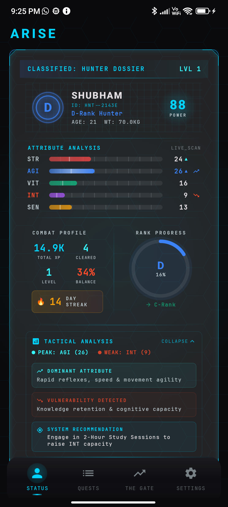
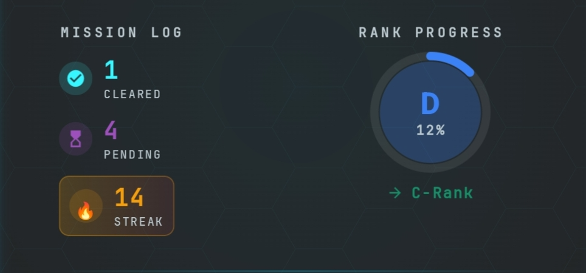

<div align="center">

# ⚔️ ARISE

### *Level up your real life, one quest at a time.*

A gamified Android app where you become the **Hunter**, complete daily **Quests**, earn rewards, and face a **Penalty** when you slack off.

<br>


</div>

---

## 📖 About

**Arise** turns your daily goals into a game. You are the Hunter. The System hands you quests, tracks your progress, rewards your consistency and punishes your failures. Every completed quest pushes your stats higher, and your **Hunter Report Card** shows how far you've come.

> Built as a personal project to practice modern Android development with Kotlin and Jetpack Compose.

---

## ✨ Features

| | Feature | Description |
|---|---|---|
| 🗡️ | **Quests** | Daily quests generated by a quest factory, ready to complete and track |
| 🏆 | **Reward Engine** | Completing quests earns rewards through a dedicated reward system |
| 📊 | **Status Screen** | See your Hunter profile and stats at a glance |
| 🪪 | **Hunter Report Card** | A summary card of your progress and performance |
| ⚠️ | **Penalty Sessions** | Miss your goals and the System assigns a penalty |
| 📜 | **System Log** | A running history of everything the System records |
| 📸 | **Snapshots** | Progress snapshots saved over time |
| ☁️ | **Cloud Sync** | Account sign-in and Firestore sync so your progress follows you |
| 🔔 | **Boot Receiver** | Background work is restored after a device restart |
| ⚙️ | **Settings** | Customize the app to your liking |

---

## 🛠️ Tech Stack

- **Language:** Kotlin
- **UI:** Jetpack Compose + Material 3
- **Architecture:** MVVM (ViewModels + Repository pattern)
- **Local database:** Room (with exported schemas)
- **Backend:** Firebase Authentication, Cloud Firestore, Crashlytics
- **Navigation:** Compose Navigation
- **Build:** Gradle (Kotlin DSL)

---

## 🏗️ Architecture

```
┌──────────────┐     ┌──────────────┐     ┌──────────────────┐
│  UI (Compose)│ ──▶ │  ViewModels  │ ──▶ │   Repositories   │
│  Screens     │ ◀── │  StateFlow   │ ◀── │ Arise / Auth /   │
└──────────────┘     └──────────────┘     │ Firestore Sync   │
                                          └────────┬─────────┘
                                                   │
                                  ┌────────────────┴───────────────┐
                                  ▼                                ▼
                          ┌──────────────┐                 ┌──────────────┐
                          │ Room (local) │                 │  Firestore   │
                          └──────────────┘                 └──────────────┘
```

### 📁 Project Structure

```
app/src/main/java/com/example/arise/
├── data/         # Room database, DAOs, repositories, Firestore sync
├── domain/       # Models, QuestFactory, RewardEngine
├── service/      # BootReceiver and background work
├── ui/
│   ├── components/   # Reusable composables (e.g. HunterReportCard)
│   └── screens/      # Status, Quests, Settings, ...
├── viewmodel/    # Auth, Quests, Settings, Status ViewModels
├── Navigation.kt
└── AriseApplication.kt
```

---

## 🚀 Getting Started

### Prerequisites

- Android Studio (latest stable recommended)
- JDK 17+
- An Android device or emulator

### Setup

1. **Clone the repository**
   ```bash
   git clone https://github.com/DeathGod-dot/Arise.git
   cd Arise
   ```

2. **Add your Firebase config**

   `google-services.json` is intentionally not included in this repo. To run the app:
   - Create a project in the [Firebase Console](https://console.firebase.google.com/)
   - Register an Android app with the package name `com.example.arise`
   - Enable **Authentication** and **Cloud Firestore**
   - Download `google-services.json` and place it in the `app/` folder

3. **Open in Android Studio**, let Gradle sync finish, then press ▶️ **Run**.

---

## 🗺️ Roadmap

- [ ] More quest types and difficulty tiers
- [ ] Achievements and titles
- [ ] Widgets and smarter reminders
- [ ] Charts for long-term progress
- [ ] Unit and UI tests

---

## 📸 Screenshots

| Status Screen | Hunter Report Card |
|:---:|:---:|
|  |  |

---

## 🤝 Contributing

Suggestions and pull requests are welcome. Fork the repo, create a branch, commit your changes and open a PR.

---

## 👤 Author

**Shubham**
- GitHub: [@DeathGod-dot](https://github.com/DeathGod-dot)

<div align="center">

⭐ If you like this project, consider giving it a star!

*"I alone level up."*

</div>
